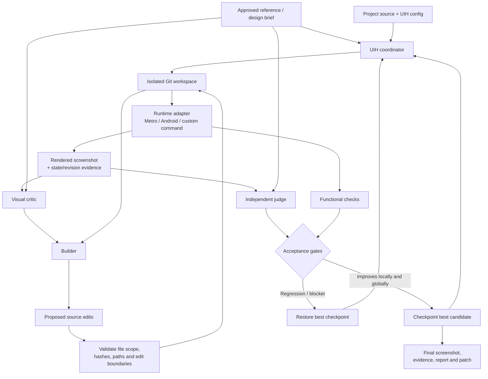

# UIH

**UIH (UI Harness)** is a repo-aware CLI for iteratively refining a real UI against an approved visual reference.

Instead of asking an AI coding agent to "make this screen look like the mockup" and trusting a one-shot edit, UIH creates a controlled visual feedback loop:

**edit → render → capture → inspect → judge → accept/reject → repeat**

It is currently aimed at React Native/Metro workflows, with runtime adapters that can also support other environments.

> **Status: 0.3 reliability candidate, not production-proven.**
>
> Live Codex OAuth critique/image generation and managed Metro/Android capture/interactions have been exercised on an isolated React Native fixture. iOS remains unverified. UIH also has **not yet demonstrated a measured quality advantage over the Codex app**; see [docs/BENCHMARK.md](docs/BENCHMARK.md).

---

## Why UIH exists

A normal AI coding agent can edit UI code, but visual work has a different failure mode from ordinary code generation: the agent can produce valid code that still looks wrong.

Typical issues include:

- spacing drifting from the mockup,
- typography and wrapping changing unexpectedly,
- a local fix making the full screen worse,
- edits being judged from code instead of the rendered result,
- stale screenshots being mistaken for the current source,
- a model approving its own changes without an independent visual check,
- regressions accumulating over several iterations.

UIH treats the **rendered UI** as the thing being optimized, not just the source code.

### Architecture



The coordinator owns the loop. Plugins do not directly mutate tracked source: builders return proposed edits, UIH validates them, applies them itself, renders the result, and evaluates the actual UI.

### Why this can be stronger than a normal AI-agent loop for visual work

| Normal AI coding agent | UIH |
|---|---|
| Often reasons mainly from source and a prompt | Re-renders the actual candidate after edits |
| May make several changes before visual verification | Runs a repeated visual feedback loop |
| Can self-judge its own implementation | Uses separate critic/builder/judge calls |
| Usually edits the developer's working tree directly | Works in an isolated Git workspace |
| A screenshot may not prove which source revision was rendered | Runtime evidence must match the expected source revision |
| A component can improve while the full page regresses | Requires local and full-screen non-regression |
| Failed attempts can leave partial edits behind | Rejects and restores the best accepted checkpoint |
| Hard to inspect exactly why an iteration won or lost | Stores screenshots, crops, findings, scores, events and patches |
| Often relies on subjective "looks better" reasoning | Combines model judgment, functional checks and explicit acceptance gates |

This is an **architectural advantage, not yet a benchmark claim**. UIH's own judge scores cannot prove UIH is better than another tool. A real comparison requires blind human evaluation across repeated trials; the benchmark plan is in [docs/BENCHMARK.md](docs/BENCHMARK.md).

---

## What UIH does

A refinement run can:

1. freeze the committed starting point, reference image, config and installed extensions;
2. discover editable source and map visual regions to component-owned files;
3. capture the baseline UI and verify functional behavior;
4. ask a critic to identify visual problems;
5. ask a builder for scoped source edits;
6. apply only validated edits;
7. render the candidate from the isolated workspace;
8. run functional checks;
9. judge component-level and full-screen visual quality/fidelity;
10. keep the change only when it passes the configured acceptance rules;
11. restore the best checkpoint after rejection, interruption or failure;
12. produce a report and `changes.patch` for human review.

Pixel difference is recorded only as a diagnostic. It does **not** determine whether a change is accepted.

---

## Quick start

### Requirements

- Node.js 22+
- npm
- Git
- Android workflows: ADB and a configured device/emulator
- iOS execution: a Mac, or a runner connected to one

Install dependencies and run the test/demo flow:

```sh
npm ci
node bin/uih.mjs --help
npm test
npm run demo
```

The demo creates a temporary synthetic Git project, accepts an improvement, rejects a regression, and produces an HTML report plus patch.

Its screenshots and scores are deterministic test fixtures; they are not evidence of AI design quality.

To expose `uih` on your PATH:

```sh
npm link
```

---

## Connect a project

From the target application's Git root:

```sh
uih init --platform react-native
uih plugin install builtin:codex
uih plugin install builtin:metro-android
uih skill install builtin:visual-quality
```

Then configure `uih.json`.

Important fields:

- **`sourceRoots`** — the smallest complete set of screens, child components and shared style sources.
- **`editable`** — existing files or directory prefixes UIH may modify.
- **scenario** — the screen/state being tested, including the exact screenshot width/height in physical pixels.
- **requirements** — product, behavior and implementation constraints.
- **runtime** — how UIH prepares, renders, captures and functionally checks the candidate.
- **roles** — planner, critic, builder, judge and designer providers.
- **budgets** — call, time, iteration and optional custom-provider cost limits.
- **acceptance** — visual quality, fidelity, minimum-improvement and judge-stability rules.

Discovery uses tracked files and heuristic import edges. It is not a complete framework compiler or static dependency graph.

---

## Codex OAuth execution

UIH uses the installed Codex CLI and its existing ChatGPT sign-in.

```sh
codex login
uih auth status
```

UIH does not read or copy OAuth tokens. The Codex CLI owns authentication, credential storage and refresh.

Each model role runs through a fresh schema-constrained `codex exec` call. Source context, screenshots, requirements and installed skill content are supplied as data. The turns are read-only; UIH itself applies validated edit proposals.

The Codex subprocess:

- checks for ChatGPT login,
- strips API-key/access-token overrides,
- forces the OpenAI provider and ChatGPT authentication,
- disables approval prompts,
- ignores user runtime configuration/hooks/MCP settings,
- validates generated image paths and freshness before importing artifacts.

There is no API-key fallback.

Optional live smoke checks, which consume subscription usage:

```sh
node examples/codex-smoke.mjs
node examples/codex-smoke.mjs --generate
```

Codex usage follows the limits of the signed-in account. Zero-dollar reservations do **not** imply free or unlimited usage.

---

## Design and approve a reference

UIH can generate candidate reference designs before implementation:

```sh
uih reference generate --brief brief.md --out drafts/home.png --candidates 3 --calls 6
uih reference import drafts/home.png
```

Generation and implementation acceptance are intentionally separate.

The design flow:

1. generates a candidate;
2. sends it through an independent design-review call;
3. feeds findings into the next candidate;
4. selects the highest-scoring non-blocking candidate;
5. records every candidate, review and reservation;
6. waits for **human review/import** before the image becomes the approved reference.

You can also import an existing PNG.

Reference import preserves the original and records hashes, dimensions and any fit transform. UIH does not silently stretch or crop mismatched references.

---

## Run visual refinement

Commit the intended application starting point first. UIH rejects dirty tracked state or untracked editable source because each run snapshots Git HEAD.

Useful commands:

```sh
uih doctor
uih inspect
uih run --iterations 12 --local-iterations 2 --minutes 30 --calls 100
uih review latest
uih resume <run-id> --iterations 20 --minutes 60 --calls 150
```

Resume limits are new **total** limits, not extra allowances.

A refinement cycle is roughly:

```text
best accepted source
      │
      ▼
visual critique
      │
      ▼
scoped builder proposal
      │
      ▼
validated source edits
      │
      ▼
functional checks
      │
      ▼
fresh runtime capture
      │
      ├── component judge
      │
      └── full-screen judge
              │
              ▼
        accept or reject
              │
      ┌───────┴────────┐
      ▼                ▼
 checkpoint        restore best
      │                │
      └────── repeat ──┘
```

By default each visual evaluation uses two judge samples. UIH takes the lower score in each dimension, blocks acceptance when any sample is blocking, and rejects unstable judgment when score spread exceeds the configured threshold.

A candidate must preserve functionality and avoid visual regression. Component-scoped work is also checked against the whole screen so a locally improved button/card cannot silently make the page worse.

When blocking full-screen problems remain, UIH prioritizes a whole-screen repair before returning to narrower component scopes.

---

## Acceptance model

At a high level, a candidate is retained only when:

- functional checks pass;
- the candidate has no blocking visual finding;
- component quality/fidelity do not regress for local work;
- full-screen visual quality does not regress;
- full-screen fidelity does not regress;
- the configured minimum improvement is reached, or a blocking issue is removed without introducing a new blocker.

The best accepted state is checkpointed in Git. Rejected candidates are discarded and the workspace is restored.

This makes the optimization loop conservative by design. It can reject useful trade-offs, so benchmark results should guide any relaxation of the acceptance policy.

---

## Android + Metro runtime

The built-in `metro-android` adapter manages Expo Go on a configured Android test device.

It can:

- start Metro for the isolated workspace;
- use a unique forwarded port through ADB;
- launch Expo Go;
- verify that the app loaded the expected source revision;
- assert expected screen content;
- perform configured interactions;
- capture a PNG;
- stop the Metro process afterward.

Example:

```json
{
  "plugin": "metro-android",
  "options": {
    "serial": "emulator-5554",
    "dependenciesPath": "C:/prepared-app/node_modules",
    "expectedTexts": ["Home"],
    "interactions": [
      {
        "name": "Save outfit",
        "tap": "save-outfit",
        "expectText": "Saved"
      }
    ]
  }
}
```

The app must expose UIH's revision marker so the adapter can prove the rendered UI corresponds to the current candidate source.

For the reference fixture, see:

```text
examples/react-native-home/src/Home.jsx
```

Expo Go may reuse cached updates, so stale-source detection is important. A stale revision fails the run instead of being accepted as valid evidence.

The adapter still captures Expo Go rather than a standalone release build. Custom native modules, dev clients and iOS need another runtime adapter.

---

## Legacy Android runtime

The legacy `android` adapter supports project-owned preparation and check scripts:

```json
{
  "plugin": "android",
  "options": {
    "serial": "emulator-5554",
    "prepare": [["node", "scripts/uih-prepare.mjs"]],
    "expectedTexts": ["Home"],
    "settleMs": 800,
    "checks": [
      {
        "name": "home behavior",
        "command": ["node", "scripts/uih-check.mjs"]
      }
    ]
  }
}
```

Those scripts belong to the target project; UIH does not generate them.

Preparation is responsible for rendering the isolated workspace, reaching the requested screen, seeding deterministic state and returning only after the runtime is ready.

---

## Other runtimes

Install `builtin:command-runtime` for web, iOS, Flutter or existing automation.

```json
{
  "plugin": "command-runtime",
  "options": {
    "capture": [
      [
        "node",
        "scripts/capture-ui.mjs",
        "--image",
        "{screenshot}",
        "--evidence",
        "{evidence}"
      ]
    ],
    "checks": [
      {
        "name": "screen interactions",
        "command": ["node", "scripts/check-ui.mjs"]
      }
    ]
  }
}
```

The runner must:

1. render the current isolated workspace;
2. establish the requested scenario;
3. write the PNG to `{screenshot}`;
4. write evidence JSON to `{evidence}`;
5. report the observed source revision;
6. run meaningful checks against that same candidate.

The revision must be observed from the app/runtime. Merely echoing the revision supplied by UIH is not valid evidence.

---

## Reports and evidence

Each attempt can retain:

- rendered screenshots;
- component crops;
- visual diff diagnostics;
- critic findings;
- judge samples;
- visual quality and fidelity scores;
- functional-check results;
- proposed edits;
- rejection reasons;
- source revision evidence;
- event history;
- best checkpoint;
- final `changes.patch`.

Review the patch manually before applying it to the original project:

```sh
git apply --check <path-to-changes.patch>
git apply <path-to-changes.patch>
```

UIH does not merge, publish or deploy application code.

Exit codes:

- `0` — configured quality thresholds met;
- `1` — failure;
- `2` — budget/iteration limit reached before targets were met.

---

## Calibration

Before trusting an evaluator/model configuration for optimization, test it on known visual rankings:

```sh
uih calibrate suite.json --repeats 3 --calls 30 --minutes 20
```

Good calibration cases include:

- spacing offsets;
- wrong font weights;
- missing actions;
- clipping;
- image substitutions;
- alignment improvements;
- a fake screenshot pasted over a non-functional page.

The last case is particularly important: visual similarity must not bypass functional checks.

See [docs/CALIBRATION.md](docs/CALIBRATION.md).

---

## Extensions

```sh
uih plugin install ./my-plugin
uih skill install ./my-skill
uih extensions
```

Local extension installation copies the package and pins its semantic version plus SHA-256 tree hash in `uih.lock.json`.

Plugins are trusted executable code. Manifest permissions are declarations, **not an OS sandbox**. Plugins inherit the process environment and local-user permissions.

Hash pinning detects extension changes after installation; it does not establish that an extension is trustworthy.

See [docs/EXTENSIONS.md](docs/EXTENSIONS.md).

---

## Reliability boundaries

Current intentional limits:

- one coordinator with sequential component passes;
- one active run per project;
- no concurrent source edits;
- managed Android adapter locks its device;
- edits are limited to existing text files;
- no autonomous dependency installation;
- no autonomous source-file creation/deletion;
- no automatic API fallback;
- no automatic retry of failed/rate-limited Codex turns;
- custom runtimes are responsible for equivalent coordination and revision evidence;
- iOS is not yet verified;
- Expo Go capture is not equivalent to standalone release-build validation;
- a measured quality advantage over normal Codex workflows has not yet been established.

Production readiness still requires representative-app trials, physical-device/iOS validation, human evaluator calibration, multi-scenario regression suites and repeated benchmark comparisons.

---

## Security model

UIH adds guardrails around source mutation, but it is **not a security sandbox**.

The coordinator checks that plugins do not directly alter tracked source or Git history during model/runtime calls. Builder proposals are validated for allowed files, source hashes, path containment and existing-file boundaries before UIH applies them.

That protects against accidental out-of-scope edits.

It does **not** make an untrusted plugin safe to execute.

---

## Further reading

- [Validation evidence](docs/VALIDATION.md)
- [Benchmark plan](docs/BENCHMARK.md)
- [Calibration format](docs/CALIBRATION.md)
- [Evidence review and verification](docs/EVIDENCE-REVIEW.md)
- [Testing](docs/TESTING.md)
- [Extension protocol](docs/EXTENSIONS.md)

Official Codex references:

- [Authentication](https://learn.chatgpt.com/docs/auth)
- [Non-interactive execution and structured outputs](https://learn.chatgpt.com/docs/non-interactive-mode)
- [Built-in image generation](https://learn.chatgpt.com/docs/image-generation)
